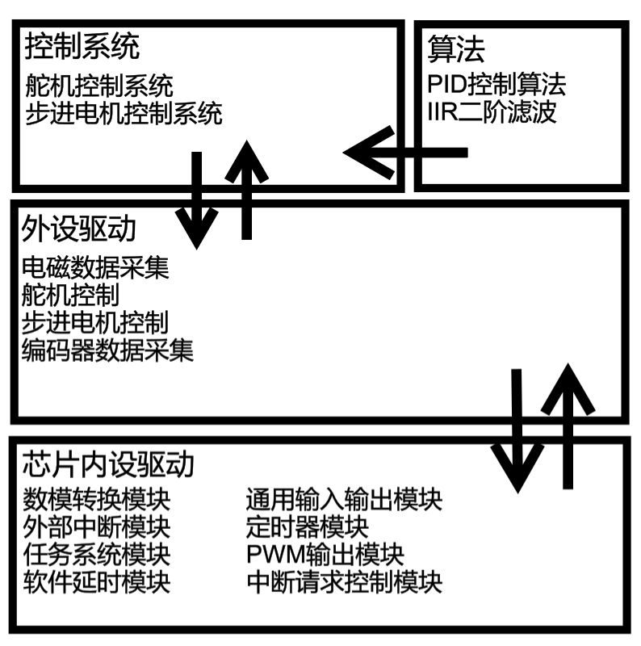

# STC16智能寻迹车项目技术文档

## 前言

该文档是第十七届NXP智能车比赛的项目说明文档，项目采用STC16F40K128系列芯片作为MCU。

## 项目结构

### 项目系统结构



### 项目目录结构

**项目下分4个目录**

##### CODES

该文件夹下存放项目所有代码文件

- ALGORITHM文件夹  该文件夹存放算法库文件
- BOARD文件夹  该文件夹存放芯片内设驱动文件
- DRIVER文件夹  该文件夹存放外设驱动
- USERS文件夹  该文件夹存放用户代码

##### HEX

该文件夹下存放项目编译生成的.hex文件

##### MDK

该文件夹存放keil工程项目文件

##### Output

该文件夹存放项目编译时生成的过渡文件

## 代码文件说明

### ALGORITHM

#### PID.h / PID.c

PID算法实现库

##### 类型定义

|        type        | struct/enum |                            param                             | note                                                         |
| :----------------: | :---------: | :----------------------------------------------------------: | ------------------------------------------------------------ |
|  PID_CONTROL_MODE  |    enum     |         PID_REALIZE_MODE = 0  PID_INCREASE_MODE = 1          | 参数说明：REALIZE_MODE为位置式PID，INCREASE_MODE为增量式PID  |
| PID_CONTROL_STRUCT |   struct    | PID_X_MODE  FACTOR_Proportional FACTOR_Integral FACTOR_Differential TARGET_VALUE PID_CURRENT_ERROR PID_LAST_ERROR PID_SUM_ERROR | 分别为PID模式、PID三个参数、目标值、误差值（用于计算、自动更新） |
|        PID         |   struct    |                              *                               | PID结构体的typedef                                           |

##### 函数接口

- **PID初始化函数**

```c
void PID_INIT_NEWPID(
    PID* NEW_PID，//未初始化过的PID控制算法
    float Param_P,//比例系数P
    float Param_I,//积分系数I
    float Param_D,//微分系数D
    float Param_Target,//PID控制的目标值(可修改)
    PID_CONTROL_MODE PID_MODE//PID控制模式（可选值见上表）
);
```

- **PID设置目标值函数**

```c
void PID_SET_TARGET(
    PID* PID_CONTROL,//PID控制算法
    float Param_Target//PID控制的目标值
);
```

- **PID设置参数函数**

```c
void PID_SET_FACTORS(
    PID* PID_CONTROL, //PID控制算法
    float Param_P, //比例系数P
    float Param_I, //积分系数I
    float Param_D  //微分系数D
);
```

- **PID计算函数**

```c
//返回PID算法计算后的返回值
float PID_CLAC_RESULT(
    PID* PID_CONTROL, //PID控制算法
    float CURRENT_INPUT //输入值
);
```

- **PID逆初始化函数**

```c
void PID_DEINIT_PID(
    PID PID_CONTROL //PID控制算法
);
```

##### 使用样例

```c
#include "PID.h"
{
    //新建PID对象
    PID MyPID;
    //初始化PID对象
    PID_INIT_NEWPID(MyPID,100,0.1,0.3,500,REALIZE_MODE);
    //设置PID目标值
    PID_SET_TARGET(MyPID,1000);
    //重设PID参数
    PID_SET_FACTORS(MyPID,100,0.1,0.3);
    //计算并保存PID返回值
    float result = PID_CLAC_RESULT(MyPID,900);
}
```

#### FILTER.h / FILTER.c

该文件是滤波器算法，还未实现。

### BOARD

#### HEADFILE.h

该文件包含了BOARD下的所有文件，方便配置需要包含的头文件

#### BOARD.h / BOARD.c

该文件包含对MCU的一些初始化操作

##### 类型定义

| define |  value   |       note        |
| :----: | :------: | :---------------: |
|  FOSC  | 30000000 | MCU工作频率 30MHZ |

##### 函数接口

|    Function     | Param | Return |        Note         |
| :-------------: | :---: | :----: | :-----------------: |
|   BOARD_INIT    | NULL  |  void  |    MCU初始化函数    |
| IQR_Disable_ALL | NULL  |  void  | 关闭MCU中断总控制位 |
| IQR_Enable_ALL  | NULL  |  void  | 开启MCU中断总控制位 |

#### ADC.h / ADC.c

该文件是数模转换模块的封装

##### 类型定义

|      type       | struct \| enum | values |      note       |
| :-------------: | :------------: | :----: | :-------------: |
| ADC_CHANNEL_PIN |      enum      | 见下表 | ADC读取引脚配置 |
|  ADC_CLK_MODE   |      enum      | 见下表 | ADC时钟模式设置 |

- ADC_CHANNEL_PIN & ADC_CLK_MODE **VALUE_TABLE**

| ADC_CHANNEL_PIN |  ADC_CLK_MODE   |
| :-------------: | :-------------: |
|  ADC_CLK_MODE1  | ADC_CHANNEL_P10 |
|  ADC_CLK_MODE2  | ADC_CHANNEL_P11 |
|  ADC_CLK_MODE3  | ADC_CHANNEL_P54 |
|  ADC_CLK_MODE4  | ADC_CHANNEL_P13 |
|  ADC_CLK_MODE5  | ADC_CHANNEL_P14 |
|  ADC_CLK_MODE6  | ADC_CHANNEL_P15 |
|  ADC_CLK_MODE7  | ADC_CHANNEL_P16 |
|  ADC_CLK_MODE8  | ADC_CHANNEL_P17 |
|  ADC_CLK_MODE9  | ADC_CHANNEL_P00 |

|     接上表     |     接上表      |
| :------------: | :-------------: |
| ADC_CLK_MODE11 | ADC_CHANNEL_P01 |
| ADC_CLK_MODE12 | ADC_CHANNEL_P02 |
| ADC_CLK_MODE13 | ADC_CHANNEL_P03 |
| ADC_CLK_MODE14 | ADC_CHANNEL_P04 |
|                | ADC_CHANNEL_P05 |
|                | ADC_CHANNEL_P06 |
|                |                 |
|                |                 |
|                |                 |

##### 函数接口

|  Function   |      Param      | Return |     Note      |
| :---------: | :-------------: | :----: | :-----------: |
| ADC_ENABLE  |      NULL       |  void  |    启用ADC    |
| ADC_DISABLE |      NULL       |  void  |    停用ADC    |
|  ADC_INIT   |  ADC_CLK_MODE   |  void  | 初始化ADC模式 |
|  ADC_READ   | ADC_CHANNEL_PIN | uint16 |  读取ADC引脚  |

##### 备注

- ADC时钟有14个模式：ADC_CLK_MODE1~14 ，CLK计算方式为ADCCLK=SYSCLK/2/x，           **MODE尽量不要小于3，若低于3会少于工作最短周期限制**

- 调用ADC_READ函数前，**请确保对应GPIO通道处于高阻模式**

#### DELAY.h / DELAY.c

软件延时封装

##### 函数接口

| Function   | Param  | Return | Note                             |
| ---------- | ------ | ------ | -------------------------------- |
| DELAY_INIT | NULL   | void   | 软件延时初始化函数               |
| DELAY_ms   | uint16 | void   | 毫秒级软件延时，参数为延时毫秒数 |
| DELAY_us   | uint32 | void   | 微秒级软件延时，参数为延时微秒数 |

##### 备注

**在调用延时函数前，确保已经调用过初始化函数**

#### EXINT.h / EXINT.c

外部中断封装

##### 类型定义

|      type       | struct\|enum | value                                                        | note                                                        |
| :-------------: | :----------: | ------------------------------------------------------------ | :---------------------------------------------------------- |
|   EXINTn_enum   |     enum     | EXINT0 = 0   EXINT1 = 1   EXINT2 = 2   EXINT3 = 3   EXINT4 = 4 | 中断0/1支持选择边沿模式/下降沿模式，中断2~4仅支持下降沿模式 |
| EXINT_MODE_enum |     enum     | BOTH_MODE = 0 FALLING_EDGE_MODE =1                           | 中断模式，BOTH为边沿，FALLIGN为下降沿                       |

##### 函数接口

|      Function      |                    Param                     | Return | Note                                                         |
| :----------------: | :------------------------------------------: | :----: | ------------------------------------------------------------ |
| EXINT_ADDRESS_INIT |                     NULL                     |  void  | 外部中断地址初始化函数                                       |
|     EXINT_INIT     | EXINTn_enum EXINT_MODE_enum   void (*func)() |  void  | 外部中断初始化,设置中断外部函数,设置外部中断模式(仅支持外部中断0/1) |
|   EXINT_SET_FUNC   |  EXINTn_enum                void (*func)()   |  void  | 设置/修改外部中断函数                                        |
|    EXINT_ENABLE    |                 EXINTn_enum                  |  void  | 使能外部中断                                                 |
|   EXINT_DISABLE    |                 EXINTn_enum                  |  void  | 终止使能外部中断                                             |

##### 使用样例

```c
#include "EXINT.h"

void func(){
    return ;
}

{
    //外部中断地址初始化函数
    EXINT_ADDRESS_INIT();
    //外部中断初始化(为INT0设置了中断函数，配置为边沿模式)
    EXINT_INIT(EXINT0,func,BOTH_MODE);
    //设置/修改外部中断函数
    EXINT_SET_FUNC(EXINT0,func);
    //使能外部中断
    EXINT_ENABLE(EXINT0);
    //终止使能外部中断
    EXINT_DISABLE(EXINT0);
}
```

